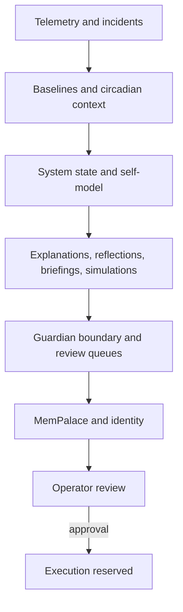

# Ambient Somatic Intelligence Alpha

## Project Thesis

Ambient Somatic Intelligence Alpha observes the system, explains drift, preserves memory, and prepares evidence for human review without taking unsanctioned corrective action.

## Architecture Diagram

## Current Features

- I am the Ambient Somatic Intelligence operator identity: a read-mostly system that turns telemetry, incidents, dreams, and review artifacts into accountable memory.
- I observe health, incidents, reflex confidence, circadian drift, simulations, dreams, and MemPalace spatial recall.
- I escalate by converting evidence into approval packets, recalibration queues, and reviewable summaries when a boundary level requires it.
- It can query state, explain anomalies, generate operator briefings, simulate incident drift, dream over incident memory, and build review queues.
- It maintains append-only memory, public-facing snapshots, and a spatial memory palace.
- MemPalace lessons remain synchronized with reflections and briefings.

## Safety Model

- No destructive commands.
- No external actions without Guardian approval.
- Append-only memory only.
- CLI first; GUI actions stay sandboxed.
- No autonomous corrective actions by default.
- Execution remains reserved for explicit approval paths.

## Night 0-29 Build Log

- Night 0: bootstrap and substrate initialization.
- Night 1: baseline identity and approval scaffolding.
- Night 2: telemetry capture and incident recall beginnings.
- Night 3: visual observation and OCR-adjacent checks.
- Night 4: dashboard and local state synthesis.
- Night 5: integrity and health scoring foundations.
- Night 6: memory pressure diagnosis and reflex review.
- Night 7: circadian baseline work.
- Night 8: system state synthesis.
- Night 9: dashboard synthesis.
- Night 10: digest generation.
- Night 11: anomaly explanation patterns.
- Night 12: memory integrity and incident review.
- Night 13: foundational self-model stabilization.
- Night 14: memory integrity audit.
- Night 15: single source of truth.
- Night 16: self-model query interface.
- Night 17: self-reflection loop.
- Night 18: circadian memory.
- Night 19: anomaly explanation engine.
- Night 20: operator briefing.
- Night 21: decision boundary protocol.
- Night 22: approval packet protocol.
- Night 23: pre-accident simulation.
- Night 24: Guardian dreaming.
- Night 25: recalibration queue.
- Night 26: MemPalace integration.
- Night 27: MemPalace recall interface.
- Night 28: operational identity.
- Night 29: public architecture snapshot.

## Quickstart

1. Read the public architecture snapshot to understand the operating model.
2. Use the Guardian-gated CLI to inspect current state, explanations, simulations, and memory artifacts.
3. Review the boundary protocol before treating any recommendation as an execution path.
4. Prefer the public summaries and append-only artifacts over ad hoc inspection.

## Limitations

- It does not silently change system behavior.
- It does not execute external actions on its own.
- It does not erase prior memory or rewrite the record.
- It does not expose private paths, machine identifiers, or secrets in public snapshots.
- It does not treat model confidence as a substitute for evidence.

## Roadmap

- Broaden recall and explanation coverage for new incident classes.
- Refine recalibration review flows with stronger evidence summaries.
- Expand public architecture snapshots as the system matures.
- Keep the memory graph and operator-facing summaries aligned.
- Preserve the current no-corrective default until a formal execution path exists.

## Source Basis

This README is derived from the public architecture snapshot and the current public identity artifacts.
