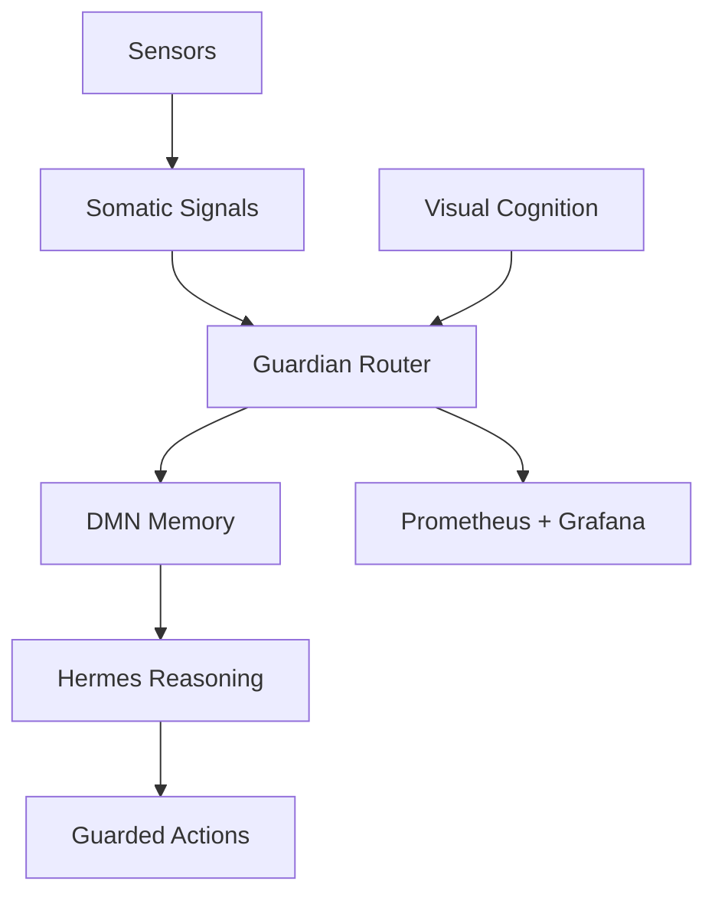

# Ambient Somatic Intelligence

> AI should not wait for accidents to understand risk.

An embodied AI operating system for pre-accident sensing - combining somatic telemetry, visual cognition, memory, and Guardian-governed action.

## Why

Most AI systems act after failure.

Ambient Somatic Intelligence explores a different question:

> Can an AI agent feel risk before it fully understands why?

Instead of waiting for alarms, logs, or incidents, this system continuously senses weak signals across infrastructure, interfaces, and environments - then turns them into memory, prediction, and guarded action.

## Core Components

- Somatic Telemetry: CPU, memory, disk, uptime, local runtime signals
- Visual Cognition: screenshot capture, OCR, anomaly detection
- DMN Memory: append-only episodic memory with validation
- Guardian Reflex: policy-gated action routing and approvals
- Observability Loop: Prometheus + Grafana
- CUA Scaffold: observe-first computer-use layer

## Milestones

### Night 0 - Cognitive Scaffold
- Hermes Agent
- Codex integration
- DMN memory
- Guardian policy

### Night 1 - Secure Substrate
- Structured action logging
- Approval records
- Immutable checksums
- Action router

### Night 2 - Body Awareness
- Prometheus
- Grafana
- Local telemetry loop

### Night 3 - Visual Layer
- Screen capture
- Visual anomaly detection

### Night 4 - Visual Cognition
- OCR
- Semantic parsing
- Confidence-based Guardian routing

## Architecture



## Quick Start

```bash
git clone https://github.com/alicken-lai/ambient-somatic-intelligence.git
cd ambient-somatic-intelligence

python3 scripts/guardian_check.py "uptime"
python3 scripts/sense_local.py

docker compose up -d
```

- Prometheus: http://localhost:9090
- Grafana: http://localhost:3000

## Safety Model

- Destructive commands are blocked.
- External actions require review.
- Memory is append-only.
- GUI interaction is observe-only until explicitly enabled.
- Guardian policy must approve action routes.

## Project Status

Early research prototype.

Night 5 planned:
Guarded low-risk visual actions.

## Research Thesis

Ambient Somatic Intelligence is an experiment in:

Embodied AI x Safety Engineering x Cognitive Infrastructure

Applications:
- AI agents
- Data centers
- Industrial systems
- Humanoid robots
- Pre-accident safety systems

## License

Apache-2.0
