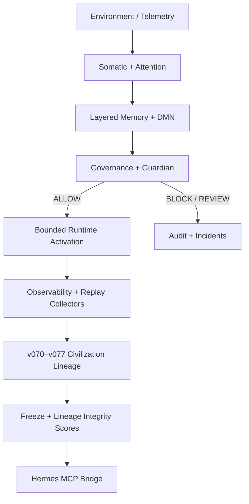

# Ambient Somatic Intelligence (Ambient OS)

> A bounded, Guardian-governed, historically reproducible civilization-scale cognition governance substrate.

**Release line:** `v0.7.x-P` — production-grade civilization governance lineage (officially frozen)

Repository: [github.com/alicken-lai/ambient-somatic-intelligence](https://github.com/alicken-lai/ambient-somatic-intelligence)

---

## 1. Project Overview

Ambient OS (Ambient Somatic Intelligence) is a **cognition governance substrate** for long-horizon, evidence-bound operational systems. It coordinates memory, attention, somatic sensing, replay, and multi-layer governance under explicit constitutional containment—not as a chat wrapper or multi-agent product framework.

The project evolved from early cognitive-runtime experiments (v0.1–v0.3) into a **civilization governance lineage** (v070–v077) hardened through the **v07xp Stabilization Program**. Public documentation at this freeze reflects **governance, reproducibility, and lineage integrity** rather than prototype feature marketing.

Ambient OS integrates with [Hermes](https://github.com/alicken-lai/hermes) as the approval and memory bridge: agents are **clients** that route side effects through Guardian before execution.

---

## 2. Ambient Somatic Intelligence Thesis

**Somatic intelligence** here means: weak environmental and operational signals are sensed, classified, and folded into governed attention and memory **before** full situational understanding is available. The system prioritizes **risk-adjacent precursors** and **provenance-backed recall** over reactive incident response.

Core thesis (non-metaphysical):

1. Cognition inputs include environment, telemetry, and governance state—not only user prompts.
2. Every materially consequential action requires **Guardian-classified** approval (`ALLOW` / `REVIEW_REQUIRED` / `BLOCK`).
3. Historical behavior must remain **replay-inspectable**; scores and gates are not decorative labels.
4. Civilization-scale governance layers are **advisory observability** unless explicitly promoted through governed doctrine—they do not silently override acceptance or salience.

This is research-grade infrastructure for **bounded sovereign cognition**, not a claim of consciousness, sentience, or general autonomy.

---

## 3. Why Bounded Cognition Matters

Unbounded agent runtimes accumulate hidden state, unverifiable self-modification, and non-replayable decisions. Ambient OS treats cognition as **operationally bounded**:

| Concern | Bounded response |
|--------|-------------------|
| Runaway execution | Guardian gates, mandatory validation, default-deny isolation |
| Memory drift | Append-only DMN, governed promotion, independent verification doctrine |
| Score gaming | Freeze thresholds, weakest-link lineage integrity, deterministic pytest regression |
| Foreign cognition | Civilization diplomacy layers—advisory only, no hive-mind merge |
| Operational lies | Reality-replay gates; `BOOTSTRAP_GAP` ≠ `DAEMON_FAILURE` in scoring |

Bounded cognition is not minimalism for its own sake—it is how a system remains **auditable across months of lineage** without rewriting history or weakening constitutional containment.

---

## 4. Civilization Governance Lineage

The v0.7 epoch introduces eight ordered governance observability layers (v070–v077), frozen as a single civilization lineage, then hardened via **v07xp**:

```
v060–v065  →  homeostasis, metacognition, coherence (pre-civilization foundation)
v065b/c    →  external skill mount, runtime soak (advisory coexistence)
v070–v077  →  civilization → reality → temporal → meaning → value → intent → purpose → agency
v07x       →  civilization freeze audit (lineage integrity scoring)
v07xp      →  stabilization program (production-grade lineage, no new layers)
```

**Governor ordering (observational chain):** runtime external → homeostasis → … → civilization → reality alignment → temporal → semantic/meaning → value → intent → purpose → agency boundary.

Each attachment is **observational only**: it does not change `accepted`, `governed_salience`, constitution, or Guardian outcomes.

---

## 5. Architecture Overview

Ambient OS spans memory, attention, governance, observability, somatic sensing, and Hermes integration. At v0.7.x-P the emphasis is the **governance stack** and **replay-safe observability**, not a flat “agent framework” diagram.



**Design invariants:**

- Memory ≠ chat history (structured layers, TTL, classification).
- Governance is mandatory for side effects, not optional middleware.
- Civilization metadata is advisory unless explicitly promoted.
- No subsystem may grow without entropy/decay discipline (earlier stabilization epochs).
- Every decision path should be explainable and replay-inspectable.

---

## 6. Governance Stack (v070 → v077) + v07xp

| Layer | Codename | Role |
|-------|----------|------|
| **v070** | Civilization Governance | Sovereign audit, diplomacy boundaries, treaty integrity, federation advisory, non-interference, provenance exchange—**no hive-mind, no autonomous diplomacy** |
| **v071** | Reality Alignment | Observability that cognition claims align with replay/evidence boundaries; does not override governor acceptance |
| **v072** | Temporal Continuity | Long-horizon temporal coherence signals across governed horizons |
| **v073** | Meaning Continuity | Semantic continuity observability (meaning drift visibility) |
| **v074** | Value Continuity | Value-chain continuity under constitutional containment |
| **v075** | Intent Continuity | Intent lineage observability without intent autonomy |
| **v076** | Purpose Boundary | Purpose-boundary reasoning; blocks motivational overreach in observability |
| **v077** | Agency Boundary | Bounded agency boundary observability—preserves non-autonomous posture |
| **v07xp** | Stabilization Program | Hardening-only epoch: determinism, normalization, replay, PatchRegistry hygiene; raised **CivilizationLineageIntegrityScoreV2** ≥ 0.95 without new layers |

Release gate documents: `docs/releases/v070_cognitive_civilization_gate.md` through `docs/releases/v077_cognitive_agency_boundary_gate.md`, plus `docs/releases/v07xp_stabilization_program_gate.md` and `docs/releases/v07xp_release_commit_hygiene_gate.md`.

---

## 7. Runtime + Replay Determinism

Runtime activation paths are designed to be **hygiene-separated** from freeze commits: logs, live `state/`, and append-only DMN ticks are operational—not lineage artifacts.

**Replay determinism principles:**

- Freeze and gate evaluation use **deterministic fixtures** and in-memory collectors where live replay windows would contaminate scores (`v07xp/runtime/replay_boundary_integrity.md`).
- Pytest regression across v060–v077 is run **reproducibly** (395 tests; 2× and 10× stabilization runs documented in v07xp gates).
- Governor observability attachments are replay-stable and **do not mutate** acceptance paths.
- Historical reality-replay failures are not hidden; synthetic health does not override failed historical gates.

Operators should treat replay PASS as **evidence of bounded behavior under test**, not as proof of unconstrained real-world autonomy.

---

## 8. Freeze Discipline + Lineage Integrity

**Freeze discipline** means civilization lineage is committed as a clean, auditable artifact set—without runtime contamination.

| Artifact | Purpose |
|----------|---------|
| `v07x_freeze/` | Initial civilization freeze audit, weakest-link scoring |
| `v07xp/` | Stabilization program evidence |
| `v07xp_release/` | Release commit hygiene, push readiness, post-commit audit |
| `observability/v07xp_freeze/` | Lineage integrity V2 evaluator snapshots |

**CivilizationLineageIntegrityScore** (v07x): weakest-link `min` across v070–v077; initial freeze snapshot ~0.940484 (below 0.95 formal threshold—**restricted freeze** classification).

**CivilizationLineageIntegrityScoreV2** (v07xp): post-stabilization **0.954016** (≥ 0.95)—**production-grade lineage** classification.

Official civilization freeze commit (lineage only, zero runtime paths in commit): `e3430983` — `feat: freeze v0.7 civilization governance lineage` (903 files; hygiene excludes logs/state/dmn).

---

## 9. Safety + Non-Autonomous Design

### Ambient OS does **NOT**

- Create autonomous agents or unsupervised self-direction
- Implement recursive self-direction or synthetic selfhood
- Weaken constitutional governance or Guardian override paths
- Allow hidden runtime mutation inside freeze commits
- Present itself as a multi-agent framework or autonomous-agent platform
- Claim consciousness, sentience, or AGI-complete capability

### Ambient OS **DOES**

- Preserve **bounded cognition** under explicit limits
- Maintain **replay-safe governance** and provenance-oriented observability
- Enforce **constitutional containment** and default-deny isolation patterns
- Preserve **provenance integrity** across memory and audit surfaces
- Maintain **deterministic cognition lineage** via scored gates and pytest regression
- Keep civilization layers **advisory-only** unless governed promotion doctrine applies
- Require Guardian classification before material side effects (via Hermes)

Additional safeguards (constitution summary):

- Destructive commands blocked by default.
- Protected paths and branches require review.
- No autonomous corrective actions without explicit approval.
- Append-only memory doctrine; no rewriting audit history to hide failures.

---

## 10. Current Status

```
Ambient OS v0.7.x-P
Status: PRODUCTION-GRADE CIVILIZATION GOVERNANCE LINEAGE
Freeze: OFFICIALLY FROZEN (civilization lineage commit on ken-dev)
```

**Verified (documentation-aligned; see gate artifacts):**

- [x] v070 → v077 civilization lineage frozen in release commit
- [x] v07xp stabilization program **PASS** (CivilizationLineageIntegrityScoreV2 ≥ 0.95)
- [x] 395 deterministic regression tests **PASS** (v060–v077 + soak paths)
- [x] Runtime hygiene **PASS** (0 runtime paths in civilization freeze commit)
- [x] Replay determinism **PASS** (boundary integrity documented)
- [x] Governor determinism **PASS** (1000-cycle replay in v07xp gate)
- [x] Bounded agency governance **PASS** (v077 agency boundary gate)
- [x] Release commit hygiene **PASS** (`docs/releases/v07xp_release_commit_hygiene_gate.md`)
- [x] Attention substrate reconstructed in this worktree (`core`, `kernel`, `dynamics`, `competition`, `memory`, `somatic`, `runtime`, `forecasting`, `calibration`, `consolidation`, `governance`, `explainability`); per-layer test suites v050→v077 **green**
- [x] Full pytest regression **PASS** (1159 tests; cross-locale `utf-8` decode fix in `tests/v044b`)
- [x] Hermes-ASI MCP bridge upgraded to **Hermes Agent v0.16.0** (`v2026.6.5`) with the custom ASI MCP shim preserved; Codex MCP client verified with 17 tools (`memory_recall`, `dmn_search`, `guardian_check`, `system_state_read`, and messaging tools)

**Not in scope of this README freeze:** pushing to `main`, enabling new governance layers (v0.7.8+), or claiming unconstrained production deployment without operator gates.

---

## 10.1 Hermes-ASI Deliberation Kernels

This worktree also contains the Hermes-ASI deliberation kernel series, an advisory reasoning and evidence layer that sits under the existing Guardian-governed operating doctrine. It does not change Guardian authority, provider permissions, credential rules, or human approval requirements.

Implemented kernels:

- Phase 1: ASI Deliberation Layer with task triage, independent children, judge, verifier, synthesizer, trace persistence, provider discovery, CLI adapter, and `hermes deliberate`.
- Phase 2: Evaluation and governance hardening with golden traces, scorecards, A/B tests, Guardian/trace/provider safety tests, observability, and `hermes deliberate-report`.
- Phase 3: Adaptive routing intelligence with ROI, effectiveness memory, dynamic child selection, strategy planning, and `hermes routing-report`, `hermes roi-report`, `hermes strategy-report`.
- Phase 4: Self-improving deliberation knowledge with skills, playbooks, pattern mining, failure learning, strategy memory, knowledge graph, and `hermes playbook-report`, `hermes skill-report`, `hermes failure-report`.
- Phase 5: Verification and evidence kernel with claim extraction, evidence objects, claim-evidence graph, contradiction detection, evidence scoring, and `hermes evidence-report`, `hermes claim-report`, `hermes verification-report`, `hermes contradiction-report`.
- Phase 6: Knowledge and evidence acquisition with source registry, evidence collector/linker, confidence model, knowledge reuse, internal knowledge index, and `hermes acquisition-report`, `hermes evidence-quality-report`, `hermes knowledge-index-report`.
- Phase 7: Trust and knowledge calibration with trust registry, calibrated confidence, trust-weighted verification, inflation/self-reference/drift detection, knowledge health scoring, and `hermes knowledge-health-report`, `hermes trust-report`, `hermes drift-report`.
- Phase 8: Institutional intelligence and reality alignment with tracked beliefs, reality scoring, fitness scoring, challenge events for high-trust knowledge, diversity measurement, echo-chamber detection, advisory external validation stubs, belief evolution, and `hermes fitness-report`, `hermes reality-report`, `hermes diversity-report`.
- Phase 9: Narrative identity and continuity with first-class identity registry, belief classification, narrative timeline, continuity analysis, identity drift detection, coherence scoring, justified identity evolution, life-history generation, identity health scoring, and `hermes identity-report`, `hermes continuity-report`, `hermes life-history-report`.

Current calibration evidence:

- Raw acquired evidence score: 100.00
- Calibrated confidence overall: 95.30
- Knowledge health score: 81.50
- Inflation risk: 0.6088, caused by repeated or low-diversity evidence sources
- Drift: none detected
- Reality score: 70.36
- Diversity score: 44.48
- Echo risk: 0.80, driven by high confidence, low source diversity, and high self-reference
- Identity health: generated as an advisory continuity score in Phase 9
- Narrative coherence: generated as a first-class identity continuity metric

The important shift is from raw evidence volume toward calibrated belief. Acquisition can raise support coverage, but calibration can still reduce health when evidence is repetitive, stale, self-referential, or low-trust.

Phase 8 adds a second check: trusted knowledge is not allowed to coast. High-trust beliefs, skills, playbooks, and sources are periodically challenged, scored against available observations and outcomes, and kept advisory under Guardian authority. The objective is calibrated contact with reality, not higher self-confidence.

Phase 9 adds institutional self-understanding without creating a persona. Hermes can describe what remained stable, what changed, why it changed, what evidence justified the change, and what it refuses to become. Identity analysis is descriptive and advisory only; it cannot modify Guardian, governance, provider permissions, credentials, or approval requirements.

---

## 11. Release Lineage

| Epoch | Tag / codename | Summary |
|-------|----------------|---------|
| v0.1.x | Foundation | DMN, Guardian, telemetry, Hermes bridge, Night build log |
| v0.2.x | Cognitive runtime | Memory layers, task graph, governance runtime, somatic bus |
| v0.3.x | Adaptive + stabilization | Self-model, entropy control, isolation kernel, causal trace v2 |
| v0.4–v0.6 | Ontology + homeostasis | Reality replay, coherence, metacognition, external runtime soak |
| **v0.7.0–v0.7.7** | **Civilization lineage** | v070–v077 ordered observability gates |
| **v07x** | Civilization freeze audit | Weakest-link integrity scoring |
| **v07xp** | Stabilization program | Production-grade lineage hardening |
| **v07xp_release** | Commit hygiene | Clean `e3430983` civilization freeze commit |

Earlier README text describing “v0.3.1-alpha stabilized cognitive runtime” as the **current** product line is superseded by **v0.7.x-P** positioning above.

---

## 12. Long-Horizon Operational Direction

Near-term operational focus (without expanding governance layers):

1. **Lineage maintenance** — keep freeze commits free of runtime state; document score regressions honestly.
2. **Replay and reality gates** — extend evidence-bound promotion; never conflate bootstrap gaps with daemon failures.
3. **Hermes operator loop** — Guardian → execute → `dmn_append`; human consent on `REVIEW_REQUIRED`.
4. **Public alignment** — README, release notes, and gate docs stay consistent with weakest-link scores.
5. **Research exports** — reproducible evaluation bundles for external review (no score threshold lowering).

Explicit non-goals for the frozen epoch: new civilization layers, ontology redesign, recursive optimization loops, or autonomous diplomacy.

---

## 13. Repository Structure

High-signal paths at v0.7.x-P (not exhaustive):

```
ambient-os/
├── governance/           Policy engine, civilization→agency modules, audit
├── observability/        v060–v077 scores, v07x_freeze, v07xp_freeze
├── attention/            core, kernel, dynamics, competition, memory, somatic,
│                         runtime, forecasting, calibration, consolidation,
│                         governance, explainability (advisory civilization hooks)
├── memory/               Layered memory, DMN integration
├── somatic/              Signal bus, environment monitor, attention runtime
├── runtime/              Task graph, isolation, entropy (pre-v0.7 stabilization)
├── kernel/               Bootstrap, integration bus
├── agents/               Specialist agents (governed, non-autonomous)
├── tests/                v060–v077 regression suites
├── docs/releases/        Per-layer gate documents
├── v070/ … v077/         Layer audit + report artifacts
├── v07x_freeze/          Civilization freeze audit
├── v07xp/                Stabilization program evidence
├── v07xp_release/        Commit hygiene + push readiness
├── hermes/rules/         Canonical operating rules (SSOT)
└── scripts/              Memory, Guardian, telemetry helpers
```

Runtime state (`logs/`, `state/`, live `memory/dmn.jsonl`) is intentionally **excluded** from civilization freeze commits.

### Operational State Commit Policy

Some runtime-adjacent files are still important enough to preserve when they
change system behavior or continuity:

- `scripts/sense_local.py` and `scripts/memory_pressure_diagnosis.py` are
  operational telemetry/diagnostic code. Cross-platform fixes here are system
  behavior changes, not temporary output.
- `tools/hermes_mcp_shim/` contains the Hermes-ASI MCP bridge shim and example
  client registration. Changes here affect cross-IDE tool availability and
  should be reviewed as runtime integration changes.
- `scripts/dmn_reflection_cycle.py`, `tools/audit_historical_dmn_governance.py`,
  and `tools/propose_dmn_metadata_sidecars.py` are governance maintenance
  tools. They must remain non-mutating by default unless an operator-approved
  workflow explicitly promotes their outputs.
- Guardian JSON state under `guardian/baselines/`, `guardian/health/`,
  `guardian/incidents/`, and `guardian/recalibration/` preserves current
  scoring, incident, and recalibration continuity. Markdown reports and
  `latest_*` narrative snapshots are usually regenerable evidence surfaces.
- `tools/mempalace/palace.json` and `tools/mempalace/palace.md` are generated
  knowledge-index artifacts, but they are useful operational recall surfaces
  when they summarize the current Guardian/reflection state.

Commit these files separately from freeze lineage changes and keep live logs,
append-only DMN, and daemon state out of ordinary feature commits unless the
operator explicitly asks for an operational snapshot.

---

## 14. Contribution / Research Notes

**Contributors and researchers should:**

1. Read `hermes/rules/canonical_rules.md` before material changes (Guardian, memory append-only, freeze rules).
2. Treat gate scores as **evidence instruments**—do not lower thresholds or weaken stress fixtures to pass freezes.
3. Run targeted pytest for touched layers: `python3 -m pytest tests/v070/ … tests/v077/ -q`
4. Evaluate lineage integrity: `PYTHONPATH=. python3 v07xp/freeze_snapshot/evaluator_v2.py`
5. Keep civilization observability **advisory** unless a governed promotion explicitly changes doctrine.

**Research questions (governance-oriented):**

- Can environmental precursors drive attention without unbounded feedback?
- Can civilization-scale metadata coexist with sovereign Guardian control?
- Can lineage integrity be scored as a weakest-link system rather than a marketing version number?

Bug reports and design discussion: use GitHub Issues on this repository. Large architectural changes should align with frozen lineage policy or propose a **new epoch**, not silent layer injection.

---

## 15. License

Apache-2.0 — see [LICENSE](LICENSE).
