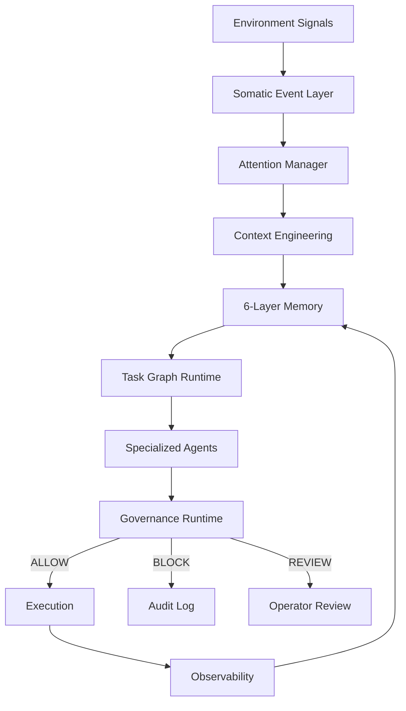

# Ambient Somatic Intelligence

> AI should not wait for accidents to understand risk.

A **persistent cognitive operating system** that transforms environmental signals into intelligent, governance-aware autonomous behavior. Built on a 7-layer architecture spanning memory, context engineering, task orchestration, governance, somatic sensing, observability, and specialized agents.

Release status: `v0.2.0-alpha` — Cognitive Architecture Phase 1–7 complete.

## Project Thesis

Ambient Somatic Intelligence is a system that **feels before it thinks**:

> Can an AI agent feel risk before it fully understands why?

Instead of waiting for alarms, logs, or incidents, this system continuously senses weak signals across infrastructure, interfaces, and environments, then turns them into memory, prediction, and guarded action — governed at every step.

## Architecture Diagram



## Cognitive Architecture (Phase 1–7)

```
ambient-os/
├── memory/              Phase 1 — 6-Layer Memory Architecture
│   ├── episodic/           Task history, execution traces, debugging sessions
│   ├── semantic/           Repo knowledge, architecture concepts
│   ├── procedural/         Successful workflows, orchestration patterns
│   ├── governance/         Blocked actions, security incidents, policy decisions
│   ├── scratchpad/         Active task context (auto-TTL, auto-cleanup)
│   └── archive/            Cold data archive
├── context/             Phase 2 — Context Engineering Layer
│   ├── budget_manager.py      Token budget allocation (6 pools)
│   ├── semantic_retriever.py  Layer-prioritized memory retrieval
│   ├── memory_compressor.py   Progressive compression (4 tiers)
│   └── assembler.py           Dynamic context assembly orchestrator
├── runtime/             Phase 3 — Task Graph Runtime
│   └── task_graph/
│       ├── dag.py             Dependency-aware DAG with cycle detection
│       ├── scheduler.py       Async parallel/sequential execution
│       ├── checkpoint.py      Execution snapshots + rollback
│       └── executor.py        High-level engine with Guardian integration
├── governance/          Phase 4 — Governance Runtime
│   ├── policy_engine.py       Structured rule-based policy evaluation
│   ├── anomaly_detector.py    Runaway agent + token abuse detection
│   ├── execution_validator.py Multi-stage pre-execution safety pipeline
│   └── audit_log.py           Immutable decision log + incident tracking
├── somatic/             Phase 5 — Somatic Event Layer
│   ├── signal_bus.py          Pub/sub bus (6 signal types × 5 urgency levels)
│   ├── attention_manager.py   4-level cognitive attention allocation
│   ├── environment_monitor.py Real-time CPU/mem/disk/load sensing
│   └── anomaly_event_stream.py Signal patterns → cognitive responses
├── observability/       Phase 6 — Observability
│   ├── tracer.py              Distributed tracing (spans/traces/tree view)
│   ├── metrics_collector.py   Counter/gauge/histogram/rate metrics
│   ├── telemetry.py           Per-agent execution profiling
│   └── dashboard.py           ASCII status dashboard + JSON reports
├── agents/              Phase 7 — Persistent Specialized Agents
│   ├── base.py                BaseAgent with state persistence + learning
│   ├── memory.py              Per-agent local knowledge store
│   ├── registry.py            Capability-indexed agent discovery
│   ├── specialists.py         6 domain experts (FE/BE/Test/Guard/Mem/Plan)
│   └── orchestrator.py        Multi-agent dispatch + execution planning
└── scripts/             Runtime Scripts
    ├── memory_store.py        Unified layered memory write API
    ├── memory_recall.py       Layer-aware retrieval with scoring
    ├── memory_index.py        Inverted index for fast lookup
    ├── memory_ttl.py          Automatic expiration + archival
    └── memory_summarize.py    Telemetry aggregation (60x reduction)
```

## Design Principles

| # | Principle | Implication |
|---|-----------|-------------|
| 1 | Memory ≠ chat history | Structured 6-layer memory with TTL and classification |
| 2 | Agent ≠ isolated chatbot | Persistent state, domain expertise, strategy learning |
| 3 | Context is a scarce resource | Token budgeting, compression, semantic retrieval |
| 4 | Governance is mandatory | Every action validated before execution |
| 5 | Environment signals are cognition inputs | Somatic bus transforms metrics into attention |
| 6 | Persistent systems require entropy management | TTL, archival, summarization, eviction |

## Current Features

### Cognitive Runtime (v0.2.0-alpha)

- **6-layer memory** with automatic classification, TTL, summarization, and inverted index.
- **Context engineering** with token budgeting (6 pools), semantic retrieval, and 4-tier progressive compression.
- **Task graph runtime** with DAG dependency resolution, async parallel execution, checkpoints, and rollback.
- **Governance runtime** with policy engine, anomaly detection, multi-stage validation, and audit trail.
- **Somatic event layer** transforming CPU/memory/disk/load into cognitive attention signals.
- **Full observability** with distributed tracing, metrics aggregation, agent telemetry, and ASCII dashboard.
- **6 specialist agents** (Frontend/Backend/Testing/Guardian/Memory/Planner) with persistent state and strategy learning.
- **Agent orchestrator** with intelligent routing (confidence 0.80–0.95), parallel dispatch, and fallback.

### Foundation (v0.1.0-alpha)

- Sensing and telemetry collection.
- Baselines, circadian context, and system state synthesis.
- Anomaly explanations, self-reflection, operator briefings, simulations, and Guardian dreaming.
- Decision boundary checks, approval packets, release audits, and recalibration queues.
- Append-only DMN memory, checksum-backed action logs, MemPalace recall, and operational identity.
- Unified `memory_recall(query)` interface over DMN, Night logs, MemPalace, and system state.
- Persistent local DMN tick loop via a separate `ai.ambient-os.dmn-tick` LaunchAgent.
- Hermes MCP server integration (memory, governance, messaging).
- Hermes v2 video-as-code module with HyperFrames-oriented templates and prompts.

## Safety & Governance Model

| Layer | Protection |
|-------|-----------|
| Policy Engine | Named rules with scopes, conditions, priorities (ALLOW/REVIEW/BLOCK) |
| Anomaly Detector | Runaway agents, token abuse, suspicious patterns, repetitive actions |
| Execution Validator | 4-stage pipeline: policy → anomaly → resource protection → context validation |
| Audit Log | Immutable decision records, incident tracking, policy effectiveness analytics |
| Attention Manager | Auto-reduces concurrency and increases governance sensitivity under stress |

Additional safeguards:
- Destructive commands are blocked by default.
- Protected paths and branches cannot be modified without review.
- Prompt injection detection in context validation stage.
- No autonomous corrective actions without explicit approval.

## Night 0-37 Build Log

- Night 0: bootstrap and substrate initialization.
- Night 1: baseline identity and approval scaffolding.
- Night 2: telemetry capture and incident recall beginnings.
- Night 3: visual observation and OCR-adjacent checks.
- Night 4: dashboard and local state synthesis.
- Night 5: integrity and health scoring foundations.
- Night 6: memory pressure diagnosis and reflex review.
- Night 7: circadian baseline work.
- Night 8: system state synthesis.
- Night 9: dashboard synthesis.
- Night 10: digest generation.
- Night 11: anomaly explanation patterns.
- Night 12: memory integrity and incident review.
- Night 13: foundational self-model stabilization.
- Night 14: memory integrity audit.
- Night 15: single source of truth.
- Night 16: self-model query interface.
- Night 17: self-reflection loop.
- Night 18: circadian memory.
- Night 19: anomaly explanation engine.
- Night 20: operator briefing.
- Night 21: decision boundary protocol.
- Night 22: approval packet protocol.
- Night 23: pre-accident simulation.
- Night 24: Guardian dreaming.
- Night 25: recalibration queue.
- Night 26: MemPalace integration.
- Night 27: MemPalace recall interface.
- Night 28: operational identity.
- Night 29: public architecture snapshot.
- Night 30: GitHub README packaging.
- Night 31: release readiness audit.
- Night 32: alpha release freeze and verification.
- Night 34: unified memory recall over fragmented memory sources.
- Night 35: persistent local Hermes nervous system and autonomous DMN tick LaunchAgent.
- Night 36: Hermes gateway diagnosis without credential or plist replacement.
- Night 37: Hermes gateway no-Discord recovery path and MCP memory tool preservation.

## Quickstart

```bash
# Memory operations
python3 scripts/memory_recall.py "recent tasks"      # Layer-aware memory recall
python3 scripts/memory_store.py                      # Store with auto-classification
python3 scripts/memory_ttl.py --dry-run              # Check TTL expirations
python3 scripts/memory_summarize.py --dry-run        # Preview telemetry summarization

# Governance
python3 scripts/guardian_check.py "uptime"           # Guardian check

# Telemetry
python3 scripts/sense_local.py                       # Collect system metrics
python3 scripts/persistent_nervous_system_health.py  # Health check

# Somatic layer (Python REPL)
python3 -c "
from somatic import SomaticSignalBus, EnvironmentMonitor, AttentionManager, AnomalyEventStream
bus = SomaticSignalBus()
monitor = EnvironmentMonitor(bus)
attention = AttentionManager(bus)
stream = AnomalyEventStream(bus, attention)
signals = monitor.sense()
print(stream.full_state())
"

# Observability dashboard
python3 -c "
from observability import Dashboard, MetricsCollector, AgentTelemetry, ExecutionTracer
dashboard = Dashboard()
print(dashboard.render())
"
```

## Somatic Signal Flow

```
Environment (CPU/Mem/Disk/Load/Processes)
        ↓
EnvironmentMonitor.sense()        — Collect real system metrics
        ↓
SomaticSignalBus.emit()           — 6 types: PRESSURE/PAIN/FATIGUE/ALERTNESS/CALM/REFLEX
        ↓                           5 urgency levels: LOW → EMERGENCY
AttentionManager                  — 4 levels: focused → alert → stressed → overwhelmed
        ↓                           Auto-adjusts: max_concurrency, context_budget, governance_sensitivity
AnomalyEventStream                — 6 rules map patterns to cognitive responses
        ↓
CognitiveResponse                 — context_compression / scheduler_throttle / emergency_pause
```

## Release Artifacts

- `RELEASE_NOTES_v0.1.0-alpha.md`
- `docs/public_architecture_snapshot.md`
- `docs/release_readiness_audit.md`
- `docs/decision_boundary_protocol.md`
- `state/system_state.json`
- `memory/recall_schema.json`

## Hermes v2 Video-as-Code Module (MVP)

Video module path: `video/`

Quickstart:

```bash
npm install
npx hyperframes --help
./scripts/render_video.sh video/examples/ai-second-brain-demo/composition.html video/renders/ai-second-brain-demo.mp4
```

Note: first-time `npx hyperframes` usage may require internet access to download the CLI package.

Current module posture:

- local-first
- agent-editable
- template-first
- ebook marketing oriented
- no external API required

Key files:

- `docs/hermes_video_as_code_workflow.md`
- `video/specs/video_schema.json`
- `video/templates/`
- `video/examples/ai-second-brain-demo/`

## Hermes Integration

The system integrates with [Hermes](https://github.com/alicken-lai/hermes) as MCP server:

- **Memory**: `dmn_append`, `memory_recall` for persistent cognitive memory
- **Governance**: `guardian_check` for pre-execution validation
- **Messaging**: Cross-platform agent communication (Telegram, Discord, Slack, etc.)

Cursor IDE acts as Commander Agent, routing all actions through Hermes governance before execution.

## Limitations

- This remains a local, memory-heavy research prototype.
- Public release artifacts are summaries; raw runtime traces are internal operational records.
- Model confidence is advisory and does not replace evidence.
- The system recommends and prepares review packets, but does not silently change system behavior.
- Somatic sensing currently uses OS-level metrics; hardware sensor integration is planned.

## Research Thesis

Ambient Somatic Intelligence is an experiment in **embodied AI cognition**, safety engineering, and cognitive infrastructure.

Core research questions:
1. Can environmental signals drive cognitive attention without explicit rules?
2. Can governance be embedded as a first-class runtime concern, not an afterthought?
3. Can persistent agents develop domain expertise through accumulated experience?

Applications:

- AI agent orchestration systems
- Data center autonomous operations
- Industrial safety systems
- Humanoid robot cognition
- Pre-accident prediction systems
- Cognitive operating systems

## License

Apache-2.0
