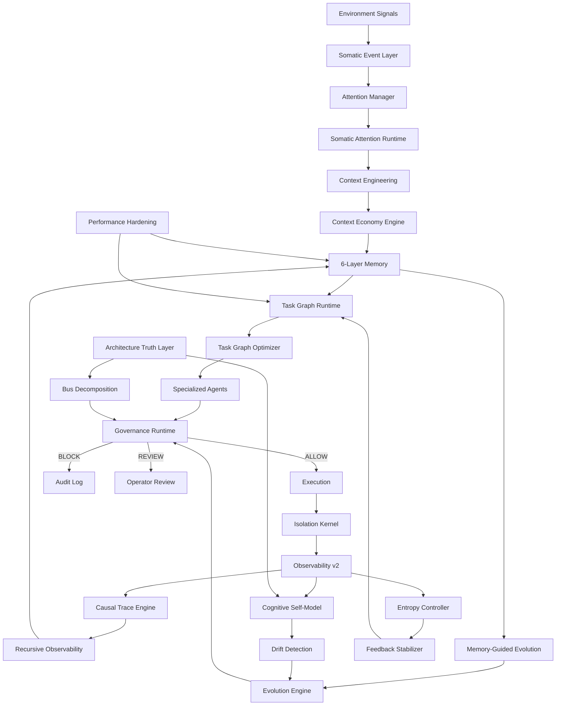

# Ambient Somatic Intelligence

> AI should not wait for accidents to understand risk.

A **persistent cognitive operating system** with somatic sensing, governance, and production-grade stability controls. Built on a 7-layer architecture spanning memory, context engineering, task orchestration, governance, somatic sensing, observability, and specialized agents — now hardened through 8 phases of systematic stabilization covering entropy control, execution isolation, feedback damping, and causal observability.

Release status: `v0.3.1-alpha — Stabilized Cognitive Runtime`

## Project Thesis

Ambient Somatic Intelligence is a system that **feels before it thinks**:

> Can an AI agent feel risk before it fully understands why?

Instead of waiting for alarms, logs, or incidents, this system continuously senses weak signals across infrastructure, interfaces, and environments, then turns them into memory, prediction, and guarded action — governed at every step.

## Architecture Diagram



## Cognitive Architecture

```
ambient-os/
├── architecture/           Stabilization — Architecture Verification
│   ├── graph_truth_layer/     Static dependency graph, coupling analysis, orphan detection
│   └── bus_decomposition/     IntegrationBus event schemas, risk report, refactor plan
├── runtime/
│   ├── task_graph/            Phase 3 — DAG execution, scheduling, checkpoints
│   ├── task_graph_optimizer/  v0.3 — Bottleneck detection, dependency compression
│   ├── evolution_engine/      v0.3 — Controlled self-refactoring
│   ├── entropy_controller/    Stabilization — Entropy scoring, damping, decay enforcement
│   ├── isolation_kernel/      Stabilization — Execution sandbox, memory boundaries
│   ├── feedback_stabilizer/   Stabilization — Loop detection, damping, amplification control
│   └── performance_hardening/ Stabilization — Latency profiling, recall cache, bottleneck map
├── observability/
│   ├── tracer.py              Distributed tracing (spans/traces/tree view)
│   ├── metrics_collector.py   Counter/gauge/histogram/rate metrics
│   ├── telemetry.py           Per-agent execution profiling
│   ├── dashboard.py           ASCII status dashboard + JSON reports
│   ├── drift_detection/       v0.3 — Architecture drift analysis
│   ├── recursive_runtime/     v0.3 — Recursive self-observability
│   └── cognitive_trace_v2/    Stabilization — Causal tracing, decision provenance, replay
├── memory/                 Phase 1 — 6-Layer Memory Architecture
│   ├── episodic/              Task history, execution traces, debugging sessions
│   ├── semantic/              Repo knowledge, architecture concepts
│   ├── procedural/            Successful workflows, orchestration patterns
│   ├── governance/            Blocked actions, security incidents, policy decisions
│   ├── scratchpad/            Active task context (auto-TTL, auto-cleanup)
│   ├── archive/               Cold data archive
│   └── evolution/             v0.3 — Memory-guided evolution + pattern mining
├── context/                Phase 2 — Context Engineering + Economy
│   ├── budget_manager.py      Token budget allocation (6 pools)
│   ├── semantic_retriever.py  Layer-prioritized memory retrieval
│   ├── memory_compressor.py   Progressive compression (4 tiers)
│   ├── assembler.py           Dynamic context assembly orchestrator
│   └── context_economy/       v0.3 — Token economy + retrieval scoring
├── governance/             Phase 4 — Governance Runtime
│   ├── policy_engine.py       Structured rule-based policy evaluation
│   ├── anomaly_detector.py    Runaway agent + token abuse detection
│   ├── execution_validator.py Multi-stage pre-execution safety pipeline
│   ├── audit_log.py           Immutable decision log + incident tracking
│   ├── mandatory_gate.py      Stabilization — Mandatory governance gate enforcement
│   ├── tool_permissions.py    Stabilization — Per-agent tool permission control
│   └── unified_router.py     Stabilization — Unified governance routing
├── somatic/                Phase 5 — Somatic Event Layer + Attention Runtime
│   ├── signal_bus.py          Pub/sub bus (6 signal types × 5 urgency levels)
│   ├── attention_manager.py   4-level cognitive attention allocation
│   ├── environment_monitor.py Real-time CPU/mem/disk/load sensing
│   ├── anomaly_event_stream.py Signal patterns → cognitive responses
│   └── attention_runtime/     v0.3 — Adaptive attention weighting + throttling
├── identity/               v0.3 — Cognitive Self-Model
│   └── cognitive_self_model/  Architecture introspection + dependency graphs
├── kernel/                 v0.3 — Integration kernel + IntegrationBus
│   ├── bootstrap.py           boot() + boot_v03() + verify_v03()
│   └── integration_bus.py     29-connection subsystem wiring
├── agents/                 Phase 7 — Persistent Specialized Agents
│   ├── base.py                BaseAgent with state persistence + learning
│   ├── memory.py              Per-agent local knowledge store
│   ├── registry.py            Capability-indexed agent discovery
│   ├── specialists.py         6 domain experts (FE/BE/Test/Guard/Mem/Plan)
│   └── orchestrator.py        Multi-agent dispatch + execution planning
└── scripts/                Runtime Scripts
    ├── memory_store.py        Unified layered memory write API
    ├── memory_recall.py       Layer-aware retrieval with scoring
    ├── memory_index.py        Inverted index for fast lookup
    ├── memory_ttl.py          Automatic expiration + archival
    ├── memory_summarize.py    Telemetry aggregation (60x reduction)
    └── verify_v03_evolution.py v0.3 verification (14 checks)
```

## System Stabilization (v0.3.1-alpha)

Eight phases of systematic hardening to transform the system from a functional cognitive runtime into a production-grade, entropy-controlled cognitive operating system.

### Phase 0 — Safety Patches

Critical runtime fixes applied across existing modules:

- Fixed `Scheduler._listeners` leak (duplicate listeners accumulated per `executor.run()`)
- Removed `sys.path` mutation from `executor.py` import-time side effect
- Added caps to `Scheduler.events` (10K limit) and `FailurePropagator.history` (1K limit)
- Fixed agent ID mismatch in `AGENT_OVERRIDES` (`"memory-manager-agent"` → `"memory-agent"`)
- Clear `TaskExecutor._current_graph` after `run()` for proper GC

### Phase 1 — Architecture Truth Layer

`architecture/graph_truth_layer/` — Structural verification of the entire system:

- **Static dependency graph**: 155 modules, 270 edges, 0 cycles detected
- **Runtime dependency verifier**: validates that actual imports match declared dependencies
- **IntegrationBus consistency checker**: 29/29 connections verified
- **Orphan module detector**: 57 orphans identified (36.8% of modules)
- **Cross-layer coupling analyzer**: 26 violations found, coupling score 0.137

### Phase 2 — Cognitive Entropy Controller

`runtime/entropy_controller/` — Prevents unbounded system growth:

- **6-dimensional entropy scoring**: memory, data files, context, listeners, feedback loops, execution
- **Damping mechanism**: configurable thresholds per entropy dimension
- **Load regulator**: hysteresis-based control to prevent oscillation
- **Decay enforcer**: TTL sweep, DMN rotation, log rotation
- **Compression triggers**: OCR bloat detection and automated compression

### Phase 3 — Execution Isolation Kernel

`runtime/isolation_kernel/` — Per-agent security boundaries:

- **Execution sandbox**: per-agent isolated execution with MandatoryGate integration
- **Memory boundaries**: layer-level write control with quotas per agent
- **Context firewall**: cross-task context isolation with token budget enforcement
- **Permission enforcer**: default-deny tool, interaction, and state access
- **Boundary definitions**: explicit permissions for all 6 specialist agents

### Phase 4 — IntegrationBus Decomposition

`architecture/bus_decomposition/` — Systematic bus analysis and refactoring roadmap:

- **29 typed event schemas**: 15 monkey-patch connections, 14 callback connections
- **Connection lifecycle registry**: full lifecycle tracking per connection
- **Risk report**: 17 findings (1 critical, 4 high, 9 medium, 3 low)
- **Refactor plan**: 23 steps across 3 priority levels (P0: 8, P1: 10, P2: 5)

### Phase 5 — Cognitive Feedback Stabilization

`runtime/feedback_stabilizer/` — Bounded, observable feedback loops:

- **5 feedback loops mapped** with safeguards analysis
- **Loop detector**: causal chain tracking with generation depth limiting
- **6 damping functions**: exponential, logarithmic, sigmoid, hysteresis, EMA, generation decay
- **Amplification controller**: cascade detection and automatic dampening
- **Stability monitor**: scoring and recommendations

### Phase 6 — Observability v2 (Causal Tracing)

`observability/cognitive_trace_v2/` — Full causal observability:

- **Causal trace schema**: 18 event types with unified trace format
- **Execution lineage tracer**: full ancestry and descendant queries
- **Decision provenance tracker**: reasoning path reconstruction
- **Memory injection tracer**: effectiveness analysis and anomaly detection
- **Replay engine**: snapshot, plan, validation, trace export/import, diff

### Phase 7 — Performance Hardening

`runtime/performance_hardening/` — Measurable performance optimization:

- **Latency profiler**: percentile tracking, trend detection, decorator API
- **Memory pressure analyzer**: 7.1MB data files, 1558 recall records analyzed
- **Recall cache**: LRU + TTL + fuzzy match for memory retrieval
- **Context reuse optimizer**: cross-task context block reuse
- **Bottleneck map**: 10 identified, top bottleneck: `recall_full_scan` (impact score 0.9)

## Design Principles

| # | Principle | Implication |
|---|-----------|-------------|
| 1 | Memory ≠ chat history | Structured 6-layer memory with TTL and classification |
| 2 | Agent ≠ isolated chatbot | Persistent state, domain expertise, strategy learning |
| 3 | Context is a scarce resource | Token budgeting, compression, semantic retrieval |
| 4 | Governance is mandatory | Every action validated before execution |
| 5 | Environment signals are cognition inputs | Somatic bus transforms metrics into attention |
| 6 | No subsystem may grow without bound | Entropy scoring, damping, decay enforcement |
| 7 | Default-deny isolation | Per-agent sandbox, memory boundaries, permission enforcer |
| 8 | Every decision must have provenance | Causal tracing, decision lineage, replay |
| 9 | Feedback loops must be observable and bounded | Loop detection, damping functions, stability monitoring |

## Current Features

### Stabilized Cognitive Runtime (v0.3.1-alpha)

- **Architecture Truth Layer** — static dependency graph (155 modules, 270 edges, 0 cycles), coupling analysis, orphan detection.
- **Cognitive Entropy Controller** — 6-dimensional entropy scoring, damping, hysteresis-based load regulation, decay enforcement.
- **Execution Isolation Kernel** — per-agent sandbox, memory boundaries, context firewall, default-deny permissions.
- **IntegrationBus Decomposition** — 29 typed event schemas, risk report (17 findings), 23-step refactor plan.
- **Feedback Stabilization** — 5 mapped loops, 6 damping functions, cascade detection, stability monitoring.
- **Observability v2** — causal trace schema (18 event types), decision provenance, memory injection tracing, replay engine.
- **Performance Hardening** — latency profiler, recall cache (LRU+TTL+fuzzy), bottleneck map (10 identified).

### Adaptive Cognitive Runtime (v0.3.0-alpha)

- **Cognitive Self-Model** — system architecture introspection via AST scanning, dependency graphs, memory topology mapping.
- **Architecture Drift Detection** — consistency scanning, dependency drift analysis, health scoring (A-F), remediation proposals.
- **Memory-Guided Evolution** — pattern mining from execution history, incident learning, optimization proposal generation.
- **Adaptive Task Graph Optimization** — bottleneck detection, latency analysis, dependency compression, redundancy detection.
- **Context Economy Engine** — token cost accounting, 3-tier budget allocation, retrieval utility scoring, entropy management.
- **Somatic Attention Runtime** — 5-factor attention weighting, anomaly amplification, stress scoring, adaptive throttling.
- **Recursive Observability** — cognition tracing, memory flow tracing, governance analytics, meta-observability (<5% overhead).
- **Controlled Self-Refactoring** — patch proposals, mutation simulation, rollback planning, evolution audit (governance-gated).

### Cognitive Runtime (v0.2.0-alpha)

- **6-layer memory** with automatic classification, TTL, summarization, and inverted index.
- **Context engineering** with token budgeting (6 pools), semantic retrieval, and 4-tier progressive compression.
- **Task graph runtime** with DAG dependency resolution, async parallel execution, checkpoints, and rollback.
- **Governance runtime** with policy engine, anomaly detection, multi-stage validation, and audit trail.
- **Somatic event layer** transforming CPU/memory/disk/load into cognitive attention signals.
- **Full observability** with distributed tracing, metrics aggregation, agent telemetry, and ASCII dashboard.
- **6 specialist agents** (Frontend/Backend/Testing/Guardian/Memory/Planner) with persistent state and strategy learning.
- **Agent orchestrator** with intelligent routing (confidence 0.80–0.95), parallel dispatch, and fallback.

### Foundation (v0.1.0-alpha)

- Sensing and telemetry collection.
- Baselines, circadian context, and system state synthesis.
- Anomaly explanations, self-reflection, operator briefings, simulations, and Guardian dreaming.
- Decision boundary checks, approval packets, release audits, and recalibration queues.
- Append-only DMN memory, checksum-backed action logs, MemPalace recall, and operational identity.
- Unified `memory_recall(query)` interface over DMN, Night logs, MemPalace, and system state.
- Persistent local DMN tick loop via a separate `ai.ambient-os.dmn-tick` LaunchAgent.
- Hermes MCP server integration (memory, governance, messaging).
- Hermes v2 video-as-code module with HyperFrames-oriented templates and prompts.

## Safety & Governance Model

| Layer | Protection |
|-------|-----------|
| Policy Engine | Named rules with scopes, conditions, priorities (ALLOW/REVIEW/BLOCK) |
| Anomaly Detector | Runaway agents, token abuse, suspicious patterns, repetitive actions |
| Execution Validator | 4-stage pipeline: policy → anomaly → resource protection → context validation |
| Audit Log | Immutable decision records, incident tracking, policy effectiveness analytics |
| Attention Manager | Auto-reduces concurrency and increases governance sensitivity under stress |
| Isolation Kernel | Per-agent execution sandbox with memory boundaries and context firewall |
| Permission Enforcer | Default-deny tool access, interaction control, state access control |
| Mandatory Gate | Governance gate enforcement for all agent actions |

Additional safeguards:
- Destructive commands are blocked by default.
- Protected paths and branches cannot be modified without review.
- Prompt injection detection in context validation stage.
- No autonomous corrective actions without explicit approval.
- Per-agent memory quotas enforced at boundary level.
- Feedback loop amplification bounded by damping functions.

## Stats

| Metric | Value |
|--------|-------|
| Modules | 70+ |
| Lines of Code | ~20,000+ |
| Classes | 160+ |
| IntegrationBus Connections | 29 |
| Entropy Dimensions | 6 |
| Damping Functions | 6 |
| Event Schema Types | 18 (causal trace) + 29 (bus) |
| Stabilization Phases | 8 |
| v0.3 Verification | 11/11 PASS |

## Quickstart

```bash
# Memory operations
python3 scripts/memory_recall.py "recent tasks"      # Layer-aware memory recall
python3 scripts/memory_store.py                      # Store with auto-classification
python3 scripts/memory_ttl.py --dry-run              # Check TTL expirations
python3 scripts/memory_summarize.py --dry-run        # Preview telemetry summarization

# Governance
python3 scripts/guardian_check.py "uptime"           # Guardian check

# Telemetry
python3 scripts/sense_local.py                       # Collect system metrics
python3 scripts/persistent_nervous_system_health.py  # Health check

# Somatic layer (Python REPL)
python3 -c "
from somatic import SomaticSignalBus, EnvironmentMonitor, AttentionManager, AnomalyEventStream
bus = SomaticSignalBus()
monitor = EnvironmentMonitor(bus)
attention = AttentionManager(bus)
stream = AnomalyEventStream(bus, attention)
signals = monitor.sense()
print(stream.full_state())
"

# Observability dashboard
python3 -c "
from observability import Dashboard, MetricsCollector, AgentTelemetry, ExecutionTracer
dashboard = Dashboard()
print(dashboard.render())
"

# v0.3 Adaptive Cognitive Runtime
python3 -c "
from kernel.bootstrap import boot, boot_v03

kernel = boot()
v03 = boot_v03(kernel)

topology = v03['self_model'].get_system_topology()
drift = v03['drift_detector'].detect(v03['self_model'])
health = v03['health_scorer'].score(drift.unified_report, drift.consistency_result)
print(f'Health grade: {health.grade}')
"

# Architecture Truth Layer
python3 -c "
from architecture.graph_truth_layer.static_dependency_graph import StaticDependencyGraph
graph = StaticDependencyGraph('.')
result = graph.build()
print(f'Modules: {result.module_count}, Edges: {result.edge_count}, Cycles: {len(result.cycles)}')
"

# Entropy scoring
python3 -c "
from runtime.entropy_controller.entropy_scorer import EntropyScorer
scorer = EntropyScorer()
report = scorer.score()
print(f'Total entropy: {report.total_score:.2f}')
for dim in report.dimensions:
    print(f'  {dim.name}: {dim.score:.2f}')
"
```

## Somatic Signal Flow

```
Environment (CPU/Mem/Disk/Load/Processes)
        ↓
EnvironmentMonitor.sense()        — Collect real system metrics
        ↓
SomaticSignalBus.emit()           — 6 types: PRESSURE/PAIN/FATIGUE/ALERTNESS/CALM/REFLEX
        ↓                           5 urgency levels: LOW → EMERGENCY
AttentionManager                  — 4 levels: focused → alert → stressed → overwhelmed
        ↓                           Auto-adjusts: max_concurrency, context_budget, governance_sensitivity
AnomalyEventStream                — 6 rules map patterns to cognitive responses
        ↓
CognitiveResponse                 — context_compression / scheduler_throttle / emergency_pause
```

## Night 0-37 Build Log

- Night 0: bootstrap and substrate initialization.
- Night 1: baseline identity and approval scaffolding.
- Night 2: telemetry capture and incident recall beginnings.
- Night 3: visual observation and OCR-adjacent checks.
- Night 4: dashboard and local state synthesis.
- Night 5: integrity and health scoring foundations.
- Night 6: memory pressure diagnosis and reflex review.
- Night 7: circadian baseline work.
- Night 8: system state synthesis.
- Night 9: dashboard synthesis.
- Night 10: digest generation.
- Night 11: anomaly explanation patterns.
- Night 12: memory integrity and incident review.
- Night 13: foundational self-model stabilization.
- Night 14: memory integrity audit.
- Night 15: single source of truth.
- Night 16: self-model query interface.
- Night 17: self-reflection loop.
- Night 18: circadian memory.
- Night 19: anomaly explanation engine.
- Night 20: operator briefing.
- Night 21: decision boundary protocol.
- Night 22: approval packet protocol.
- Night 23: pre-accident simulation.
- Night 24: Guardian dreaming.
- Night 25: recalibration queue.
- Night 26: MemPalace integration.
- Night 27: MemPalace recall interface.
- Night 28: operational identity.
- Night 29: public architecture snapshot.
- Night 30: GitHub README packaging.
- Night 31: release readiness audit.
- Night 32: alpha release freeze and verification.
- Night 34: unified memory recall over fragmented memory sources.
- Night 35: persistent local Hermes nervous system and autonomous DMN tick LaunchAgent.
- Night 36: Hermes gateway diagnosis without credential or plist replacement.
- Night 37: Hermes gateway no-Discord recovery path and MCP memory tool preservation.

## Release Artifacts

- `RELEASE_NOTES_v0.3.0-alpha.md`
- `RELEASE_NOTES_v0.1.0-alpha.md`
- `docs/public_architecture_snapshot.md`
- `docs/release_readiness_audit.md`
- `docs/decision_boundary_protocol.md`
- `state/system_state.json`
- `memory/recall_schema.json`

## Hermes v2 Video-as-Code Module (MVP)

Video module path: `video/`

Quickstart:

```bash
npm install
npx hyperframes --help
./scripts/render_video.sh video/examples/ai-second-brain-demo/composition.html video/renders/ai-second-brain-demo.mp4
```

Note: first-time `npx hyperframes` usage may require internet access to download the CLI package.

Current module posture:

- local-first
- agent-editable
- template-first
- ebook marketing oriented
- no external API required

Key files:

- `docs/hermes_video_as_code_workflow.md`
- `video/specs/video_schema.json`
- `video/templates/`
- `video/examples/ai-second-brain-demo/`

## Hermes Integration

The system integrates with [Hermes](https://github.com/alicken-lai/hermes) as MCP server:

- **Memory**: `dmn_append`, `memory_recall` for persistent cognitive memory
- **Governance**: `guardian_check` for pre-execution validation
- **Messaging**: Cross-platform agent communication (Telegram, Discord, Slack, etc.)

Cursor IDE acts as Commander Agent, routing all actions through Hermes governance before execution.

## Limitations

- This remains a local, memory-heavy research prototype.
- Public release artifacts are summaries; raw runtime traces are internal operational records.
- Model confidence is advisory and does not replace evidence.
- The system recommends and prepares review packets, but does not silently change system behavior.
- Somatic sensing currently uses OS-level metrics; hardware sensor integration is planned.

## Research Thesis

Ambient Somatic Intelligence is an experiment in **embodied AI cognition**, safety engineering, and cognitive infrastructure.

Core research questions:
1. Can environmental signals drive cognitive attention without explicit rules?
2. Can governance be embedded as a first-class runtime concern, not an afterthought?
3. Can persistent agents develop domain expertise through accumulated experience?
4. Can a cognitive system maintain stability while continuously evolving?
5. Can feedback loops be made observable and self-regulating?

Applications:

- AI agent orchestration systems
- Data center autonomous operations
- Industrial safety systems
- Humanoid robot cognition
- Pre-accident prediction systems
- Cognitive operating systems

## License

Apache-2.0
