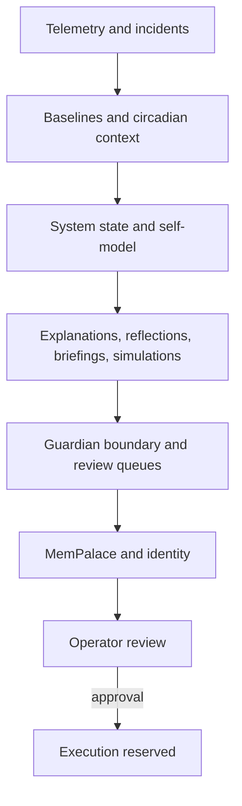

# Ambient Somatic Intelligence Alpha

> AI should not wait for accidents to understand risk.

Ambient Somatic Intelligence Alpha is a Guardian-governed memory and observation system that turns telemetry, incidents, simulations, reflections, and review artifacts into accountable action proposals without autonomous corrective behavior.

Release status: `v0.1.0-alpha`, completed through Night 32.

## Project Thesis

Ambient Somatic Intelligence observes the system, explains drift, preserves memory, and prepares evidence for human review without taking unsanctioned corrective action.

The project explores one central question:

> Can an AI agent feel risk before it fully understands why?

Instead of waiting for alarms, logs, or incidents, this system continuously senses weak signals across infrastructure, interfaces, and environments, then turns them into memory, prediction, and guarded review.

## Architecture Diagram



## Current Features

- Sensing and telemetry collection.
- Baselines, circadian context, and system state synthesis.
- Anomaly explanations, self-reflection, operator briefings, simulations, and Guardian dreaming.
- Decision boundary checks, approval packets, release audits, and recalibration queues.
- Append-only DMN memory, checksum-backed action logs, MemPalace recall, and operational identity.
- Public architecture, README, release notes, and first alpha release packaging.

## Safety Model

- Destructive commands are blocked.
- External actions require Guardian approval.
- Memory is append-only.
- CLI is preferred over GUI.
- GUI interaction remains sandboxed.
- Guardian policy must approve action routes.
- No autonomous corrective actions by default.
- Execution remains reserved for explicit approval paths.

## Night 0-32 Build Log

- Night 0: bootstrap and substrate initialization.
- Night 1: baseline identity and approval scaffolding.
- Night 2: telemetry capture and incident recall beginnings.
- Night 3: visual observation and OCR-adjacent checks.
- Night 4: dashboard and local state synthesis.
- Night 5: integrity and health scoring foundations.
- Night 6: memory pressure diagnosis and reflex review.
- Night 7: circadian baseline work.
- Night 8: system state synthesis.
- Night 9: dashboard synthesis.
- Night 10: digest generation.
- Night 11: anomaly explanation patterns.
- Night 12: memory integrity and incident review.
- Night 13: foundational self-model stabilization.
- Night 14: memory integrity audit.
- Night 15: single source of truth.
- Night 16: self-model query interface.
- Night 17: self-reflection loop.
- Night 18: circadian memory.
- Night 19: anomaly explanation engine.
- Night 20: operator briefing.
- Night 21: decision boundary protocol.
- Night 22: approval packet protocol.
- Night 23: pre-accident simulation.
- Night 24: Guardian dreaming.
- Night 25: recalibration queue.
- Night 26: MemPalace integration.
- Night 27: MemPalace recall interface.
- Night 28: operational identity.
- Night 29: public architecture snapshot.
- Night 30: GitHub README packaging.
- Night 31: release readiness audit.
- Night 32: alpha release freeze and verification.

## Quickstart

```bash
python3 scripts/guardian_check.py "uptime"
python3 scripts/sense_local.py
python3 scripts/build_release.py --build
```

Optional local observability stack:

```bash
docker compose -f observability/docker-compose.yml up -d
```

- Prometheus: `http://localhost:9090`
- Grafana: `http://localhost:3000`

## Release Artifacts

- `RELEASE_NOTES_v0.1.0-alpha.md`
- `docs/public_architecture_snapshot.md`
- `docs/release_readiness_audit.md`
- `docs/decision_boundary_protocol.md`
- `state/system_state.json`

## Hermes v2 Video-as-Code Module (MVP)

Video module path: `video/`

Quickstart:

```bash
npm install
npx hyperframes --help
./scripts/render_video.sh video/examples/ai-second-brain-demo/composition.html video/renders/ai-second-brain-demo.mp4
```

Note: first-time `npx hyperframes` usage may require internet access to download the CLI package.

Current module posture:

- local-first
- agent-editable
- template-first
- ebook marketing oriented
- no external API required

## Limitations

- This remains a local, memory-heavy research prototype.
- Public release artifacts are summaries; raw runtime traces are internal operational records.
- Model confidence is advisory and does not replace evidence.
- The system recommends and prepares review packets, but does not silently change system behavior.

## Research Thesis

Ambient Somatic Intelligence is an experiment in embodied AI, safety engineering, and cognitive infrastructure.

Applications:

- AI agents
- Data centers
- Industrial systems
- Humanoid robots
- Pre-accident safety systems

## License

Apache-2.0
