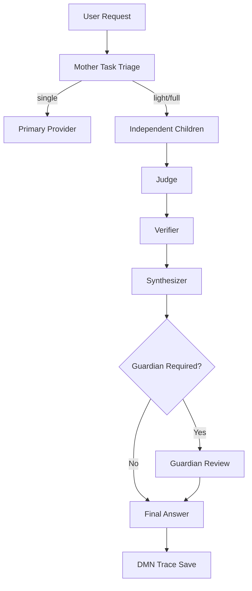

# ASI Deliberation Layer

The ASI Deliberation Layer is a governed internal deliberation system for Hermes-ASI. It is not simple model voting. Fusion can be an implementation pattern, but the system goal is auditable deliberation under provider governance.



## Provider Governance

- IDEs are not providers by themselves.
- CLI tools, API bridges, MCP servers, and OpenAI-compatible endpoints are providers only when they expose a legitimate callable interface.
- Configured CLI providers are disabled until explicitly enabled and health checked.
- OpenRouter remains disabled unless the user explicitly configures it.
- Copilot-first remains the default path.
- Hidden IDE quota must never be used unless a CLI exposes a legitimate callable command.

## CLI Provider Setup

CLI providers live in `config/provider_registry.yaml` with explicit `command` and safe `health_check.args`. Discovery only checks configured commands from `PATH`, only uses safe version-style health checks, and never executes arbitrary user input.

Example:

```yaml
providers:
  claude_cli:
    enabled: false
    type: cli
    command: claude
    health_check:
      args: ["--version"]
    fallback: copilot
```

## Modes

- `single`: one provider path, no jury.
- `light`: engineering and risk children, then judge and synthesizer.
- `full`: three children, judge, verifier, synthesizer, and trace persistence.
- `guardian_required`: full deliberation plus Guardian review requirement before state-changing action.

## Safety Rules

Guardian review is required before file mutation, shell execution, provider changes, memory writes, credential access, network exposure, deployment, deletion, and repo-wide refactors. Traces redact tokens, API keys, credentials, auth headers, and bearer values.

## CLI

```powershell
python scripts/hermes.py deliberate "Review this provider registry design" --mode full --dry-run --json
python scripts/hermes.py deliberate "Implement a CLI provider adapter" --mode guardian_required --show-trace
```

## Failure Modes

- Command missing from `PATH`: provider is reported unavailable.
- Health check timeout: provider is reported as timed out.
- Disabled provider: discovery records it, but deliberation does not use it.
- Unsupported claim: verifier marks it `not_checked` unless allowed evidence is supplied.
- State-changing task: mode escalates to `guardian_required`.

## Roadmap

Future work can connect child roles to enabled provider adapters, add real Guardian approval transport, and promote trace summaries into DMN through an append-only governed memory writer.
