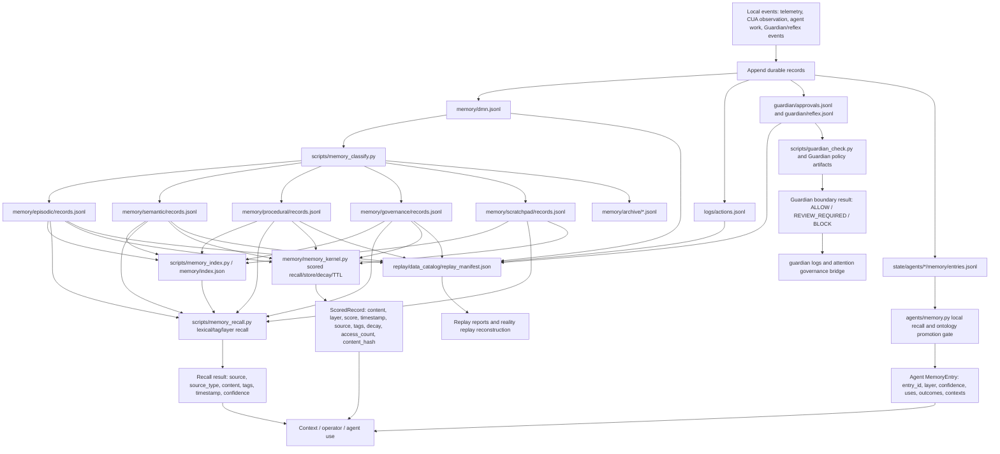
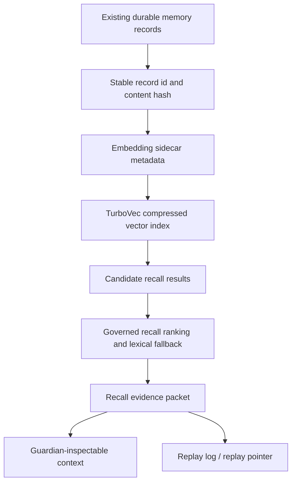
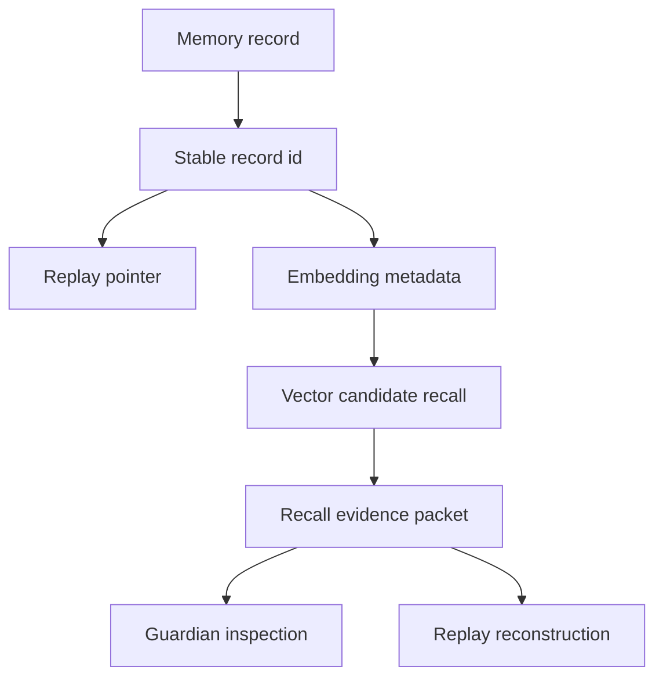

# Memory Dataflow Diagram

Phase: 1A Memory Architecture Design Review  
Date: 2026-06-09  
Scope: Current repository findings only.

## Current Observed Dataflow

## Recommended TurboVec Position

TurboVec belongs between durable memory records and governed recall ranking. It should produce candidate recalls only.

## Actual Components Used In This Diagram

| Component | Repository Evidence |
| --- | --- |
| DMN append-only memory | `memory/dmn.jsonl`, `memory/schema.json` |
| Layer classification | `scripts/memory_classify.py` |
| Layered memory files | `memory/episodic/records.jsonl`, `memory/semantic/records.jsonl`, `memory/procedural/records.jsonl`, `memory/governance/records.jsonl`, `memory/scratchpad/records.jsonl` |
| Inverted index | `scripts/memory_index.py`, `memory/index.json` |
| Unified lexical recall | `scripts/memory_recall.py`, `memory/recall_schema.json` |
| Kernel recall/store | `memory/memory_kernel.py` |
| Agent-local memory | `agents/memory.py`, `state/agents/*/memory/entries.jsonl` |
| Ontology promotion | `memory/ontology/layer_definition.py`, `memory/ontology/promotion_rules.py`, `agents/memory.py` |
| Replay catalog | `replay/data_catalog/replay_manifest.json`, `replay/data_catalog/source_inventory.md` |
| Guardian classification | `scripts/guardian_check.py`, `guardian/policy.yaml`, `guardian/decision_boundary.yaml` |
| Trace schemas | `observability/trace_schema.py`, `observability/cognitive_trace_v2/causal_trace_schema.py` |

## Missing Dataflow Required Before TurboVec

The missing pieces are schema and evidence contracts, not vector implementation.

