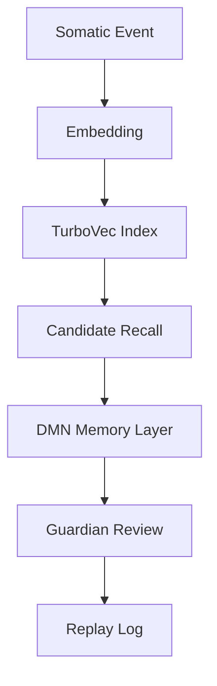

# TurboVec Integration Plan

## Purpose

This document defines the approved path for evaluating TurboVec in ASI.

TurboVec is a candidate recall layer. TurboVec is not a decision layer. TurboVec is not a governance layer.

## Current State

ASI currently treats memory, replay, Guardian review, and governance as separate responsibilities. The repository does not yet implement TurboVec as production infrastructure.

Any TurboVec work must begin as a proof of concept in experimental zones and must not modify runtime behavior, Guardian logic, governance rules, replay gates, memory promotion, or DMN scoring.

## Target State

TurboVec may become compressed vector recall infrastructure for efficient embedding storage and candidate retrieval.

The target state is:

- DMN remains the governed memory layer.
- Guardian remains the safety review layer.
- Replay remains the audit reconstruction layer.
- TurboVec only stores embeddings and returns candidate recalls.
- Candidate recalls are treated as evidence, not truth.

## Architecture Diagram

## Integration Boundaries

TurboVec may:

- Store embeddings.
- Retrieve candidate memories.
- Return similarity scores.
- Support experimental recall benchmarks.
- Operate inside `experiments/`, `memory/vector/`, `adapters/`, `docs/`, and `tests/`.

TurboVec may not:

- Trigger Guardian actions.
- Approve or reject actions.
- Modify DMN memory records.
- Promote memory.
- Change runtime behavior.
- Change replay gates.
- Become a source of truth.

## Phase 1 Proof of Concept

Create or maintain only experimental artifacts:

- `experiments/turbovec_memory_poc.py`
- `memory/vector/turbovec_adapter.py`
- `tests/test_turbovec_adapter.py`
- `docs/TURBOVEC_INTEGRATION_PLAN.md`

Required output schema:

- `event_id`
- `timestamp`
- `source_node`
- `sensor_type`
- `embedding_model`
- `vector_backend`
- `recalled_event_ids`
- `similarity_score`
- `confidence`
- `reason`
- `replay_reference`
- `no_decision_made=true`

## Rollback Strategy

TurboVec adoption must be reversible.

Rollback requirements:

- Disable TurboVec adapter configuration.
- Preserve DMN memory compatibility.
- Preserve replay logs.
- Keep existing recall behavior available.
- Remove or quarantine generated indexes if they are corrupt, stale, or unsafe.
- Document rollback in a decision log entry.

## Success Metrics

TurboVec evaluation succeeds only if it demonstrates:

- Reliable candidate recall quality.
- Clear separation from decision-making.
- Stable ingestion behavior.
- Reproducible benchmark results.
- Replay references for recall outputs.
- No autonomous action.
- No modification to Guardian, governance, runtime, or DMN promotion behavior.

## Failure Criteria

TurboVec evaluation fails if it:

- Produces action decisions.
- Is treated as a source of truth.
- Causes Guardian decisions to depend solely on similarity scores.
- Reduces replayability or auditability.
- Requires unsafe raw data synchronization.
- Introduces unbounded dependency or operational risk.
- Cannot be disabled without affecting core system behavior.
