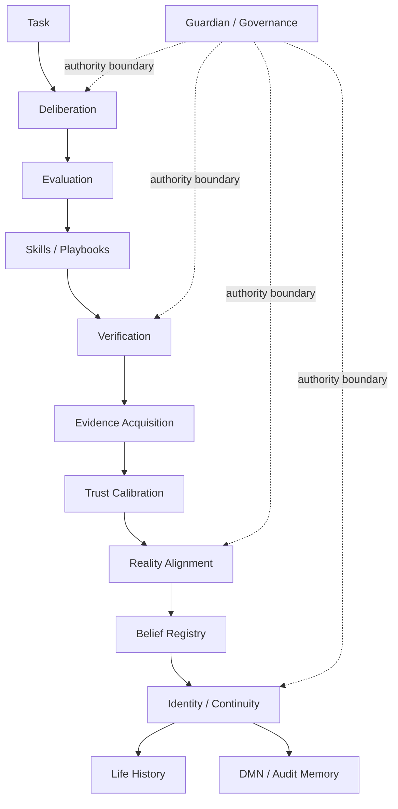
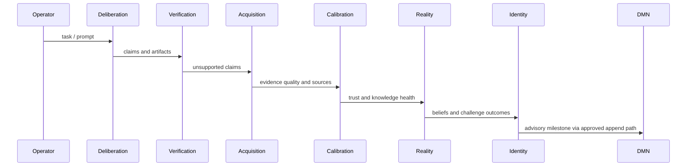
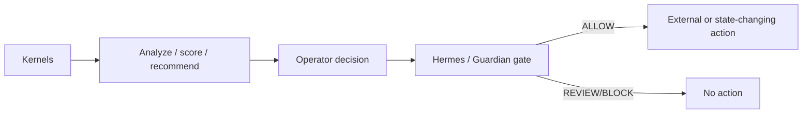

# Hermes-ASI v0.9 Architecture

Hermes-ASI v0.9 is a coherent advisory institutional intelligence system. It is not an autonomous governance authority.

## Kernel Relationships

## Lifecycle

## Governance Boundaries

Kernels may analyze, describe, score, and recommend. They may not modify Guardian, governance rules, credentials, provider permissions, or approval requirements.

## Identity Integration

Identity consumes belief registry, reality reports, trust/drift reports, and recent DMN summaries. It answers:

- Who has Hermes-ASI been?
- What remains stable?
- What changed?
- Why did it change?
- What does it refuse to become?

## Reality Alignment Integration

Reality alignment challenges high-trust beliefs, not only weak beliefs. It produces reality score, fitness score, diversity score, and echo risk.

## DMN Integration

DMN remains append-only. Kernels do not write DMN automatically. Operator/Hermes-mediated append remains the safe integration path.

## Release Posture

v0.9 is release-candidate ready as an advisory institutional intelligence architecture, with runtime snapshot hygiene identified as the main follow-up.
