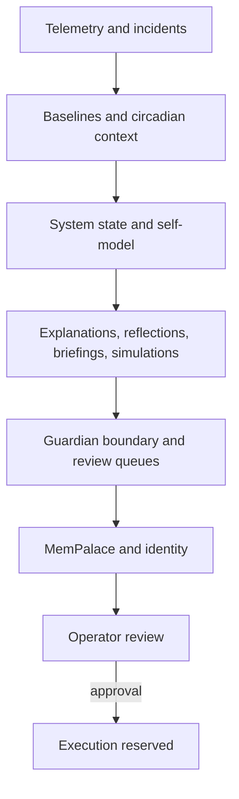

# Ambient Somatic Intelligence Alpha

## Mission

Ambient Somatic Intelligence Alpha observes the system, explains drift, preserves memory, and prepares evidence for human review without taking unsanctioned corrective action.

## Architecture Layers

1. Sensing and telemetry collection
2. Baselines and circadian context
3. Self-model and state synthesis
4. Explanation, briefing, and simulation
5. Guardian review and approval boundary
6. Append-only memory surfaces
7. Spatial recall and operational identity

## Night 0-28 Milestones

- Night 0-13: foundation work established logging, Guardian governance, memory integrity, dashboarding, and the first self-model loops.
- Night 14: memory integrity audit.
- Night 15: single source of truth.
- Night 16: self-model query interface.
- Night 17: self-reflection loop.
- Night 18: circadian memory.
- Night 19: anomaly explanation engine.
- Night 20: operator briefing.
- Night 21: decision boundary protocol.
- Night 22: approval packet protocol.
- Night 23: pre-accident simulation.
- Night 24: Guardian dreaming.
- Night 25: recalibration queue.
- Night 26: MemPalace integration.
- Night 27: MemPalace recall interface.
- Night 28: operational identity.

## Current Capabilities

- I am the Ambient Somatic Intelligence operator identity: a read-mostly system that turns telemetry, incidents, dreams, and review artifacts into accountable memory.
- I observe health, incidents, reflex confidence, circadian drift, simulations, dreams, and MemPalace spatial recall.
- I escalate by converting evidence into approval packets, recalibration queues, and reviewable summaries when a boundary level requires it.
- It can query state, explain anomalies, generate operator briefings, simulate incident drift, dream over incident memory, and build review queues.
- It maintains append-only memory, public-facing snapshots, and a spatial memory palace.
- MemPalace lessons remain synchronized with reflections and briefings.

## Safety Boundaries

- No destructive commands.
- No external actions without Guardian approval.
- Append-only memory only.
- CLI first; GUI actions stay sandboxed.
- No autonomous corrective actions by default.
- Execution remains reserved for explicit approval paths.

## What It Does Not Do

- It does not silently change system behavior.
- It does not execute external actions on its own.
- It does not erase prior memory or rewrite the record.
- It does not expose private paths, machine identifiers, or secrets in public snapshots.
- It does not treat model confidence as a substitute for evidence.

## Future Roadmap

- Broaden recall and explanation coverage for new incident classes.
- Refine recalibration review flows with stronger evidence summaries.
- Expand public architecture snapshots as the system matures.
- Keep the memory graph and operator-facing summaries aligned.
- Preserve the current no-corrective default until a formal execution path exists.

## Operating Context

- reflection: Health is 76.53 with stable trend; memory risk is watch at 97.69% used; baseline deviation is elevated. Latest digest references state generated 2026-05-11T23:18:17.337821+00:00.
- briefing: Health remains 76.53 with stable trend. Memory pressure is the dominant learned risk, and circadian context now downgrades reflex confidence to 0.05.
- dream_theme: repeated memory pressure with watch-level reflex suppression
- boundary_levels: ["OBSERVE_ONLY: read-only observation and query actions.","RECOMMEND_ONLY: derived analysis and append-only summaries.","PREPARE_FOR_APPROVAL: guarded readiness checks for review.","EXECUTE_ALLOWED: reserved for explicitly approved execution."]
