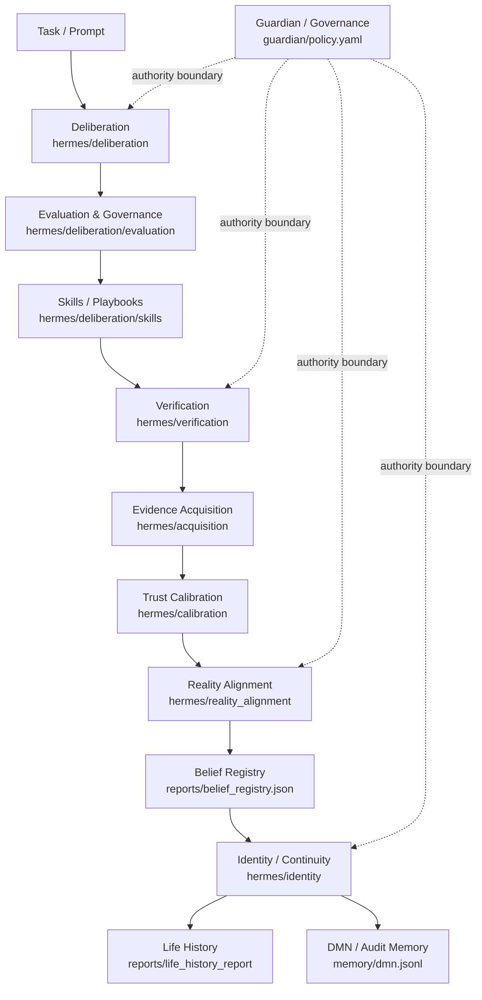
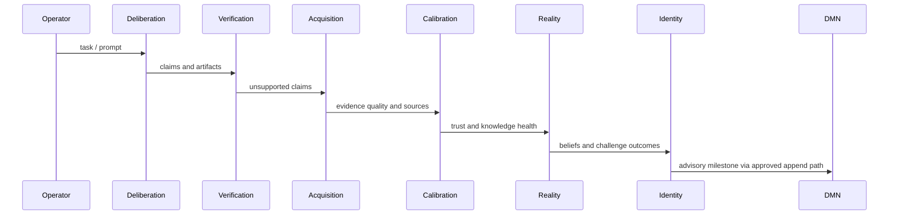
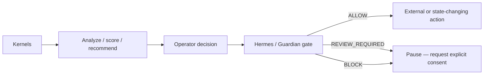
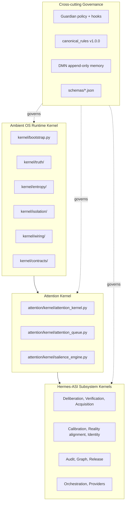

# Hermes-ASI v0.9.0-rc1 Architecture Snapshot — Frozen Baseline

```yaml
release_label: v0.9.0-rc1
release_status: conditionally ready as advisory institutional intelligence
snapshot_date: 2026-06-15
canonical_rules_version: 1.0.0
kernel_version: 0.4.1-alpha
commit_hash: 100721804d5f087c0214ef6caf14b75f70b2f73b
branch: codex/deliberation-kernels
snapshot_kind: frozen_baseline
```

> **This is a frozen baseline.** Future phases measure against this snapshot. Any drift from the structure, boundaries, or doctrine documented here must be justified through a governed change process and recorded in `docs/decision_logs/`.

---

## 1. Purpose

This document is the frozen architecture reference for Hermes-ASI v0.9.0-rc1. It captures:

- Phase 1-9 architecture overview
- Kernel relationships
- Governance boundaries
- DMN integration
- Identity integration
- Reality alignment integration

It is intentionally a point-in-time view. Living architecture documentation remains at `docs/architecture/HERMES_ASI_V09.md`; this snapshot is the v0.9.0-rc1 measurement anchor.

---

## 2. Phase 1-9 Overview

Hermes-ASI v0.9.0-rc1 is an **advisory institutional intelligence architecture**. It is not an autonomous governance authority. Kernels analyze, score, and recommend; the operator and the Guardian gate decide and act.

| Phase | Theme | Outcome |
|-------|-------|---------|
| Phase 1 | Ambient OS runtime kernel | Truth graph, entropy controller, isolation kernel, reversible wiring, integration bus |
| Phase 2 | Stabilization (v0.4) | Truth / Entropy / Isolation unified under v04_stabilization container |
| Phase 3 | Somatic metacognition | Somatic memory layers, ontology promotion chain |
| Phase 4 | Attention kernel | Attention queue, salience engine, priority allocator, novelty detector |
| Phase 5 | Cognitive governance | Policy engine, anomaly detector, agency / reality / civilization / cognition / identity / homeostasis governance |
| Phase 6 | Cognitive continuity series (v0.6x-v0.7x) | Temporal continuity, meaning, value, intent, purpose boundary, agency boundary |
| Phase 7 | External skill mount, runtime soak | Karpathy guidelines external skill, v065c runtime soak gate |
| Phase 8 | Deliberation and verification kernels | ASI deliberation layer, verification evidence kernel, knowledge acquisition, trust calibration |
| Phase 9 | Reality alignment and identity kernels | Reality alignment, narrative identity and continuity, institutional audit, graph health, release health |

At the v0.9.0-rc1 freeze, the architecture comprises **12 kernels / major subsystems** and **29 CLI commands**, governed by canonical rules v1.0.0 and the Guardian layer.

---

## 3. Kernel Relationships



### Kernel Inventory

| Kernel | Path | Authority Boundary |
|--------|------|--------------------|
| Deliberation | `hermes/deliberation/` | Yes — Guardian gates routing decisions |
| Evaluation and governance | `hermes/deliberation/evaluation/` | Yes — judges deliberation outcomes |
| Adaptive routing intelligence | `hermes/deliberation/router/` | Yes — provider selection gated by route policy |
| Self-improving deliberation knowledge | `hermes/deliberation/skills/` | Yes — promotion chain governed |
| Verification and evidence | `hermes/verification/` | Yes — verification independence enforced |
| Knowledge acquisition | `hermes/acquisition/` | Yes — source trust calibration |
| Trust and knowledge calibration | `hermes/calibration/` | Yes — drift detection feeds Guardian |
| Reality alignment | `hermes/reality_alignment/` | Yes — challenge outcomes are advisory |
| Narrative identity and continuity | `hermes/identity/` | Yes — identity evolution is append-only |
| Institutional audit | `hermes/audit/` | Yes — audit reports are immutable evidence |
| Graph health | `hermes/graph/` | Yes — graph evidence is read-only snapshot |
| Release health | `hermes/release/` | Yes — RC scoring is fixed formula |

---

## 4. Lifecycle



The lifecycle is **strictly advisory**. Each arrow represents evidence and recommendation flow, not control transfer. The operator owns every external action.

---

## 5. Governance Boundaries



### Intentionally immutable in v0.9.0-rc1

- Canonical rules v1.0.0 (`hermes/rules/canonical_rules.md`)
- Guardian risk classes: `ALLOW`, `REVIEW_REQUIRED`, `BLOCK` (see `guardian/policy.yaml` for SSOT)
- Memory append-only doctrine
- BOOTSTRAP_GAP vs DAEMON_FAILURE distinction
- Verification independence (the implementer does not self-verify)
- Promotion chain L1 -> L2 -> L3 -> L4
- Outbound messaging double confirmation
- DMN language is English (avoids encoding corruption)
- Schemas under `schemas/` (9 files)

Kernels may analyze, describe, score, and recommend. They may **not** modify Guardian, governance rules, credentials, provider permissions, or approval requirements.

---

## 6. DMN Integration

DMN (Durable Memory Node) remains **append-only**:

- Kernels do not write DMN automatically
- Operator / Hermes-mediated append is the only safe integration path
- All writes pass schema validation against `schemas/dmn_event.schema.json`
- `tools/validate_dmn_events.py` is the canonical validator
- DMN language must be English to avoid encoding corruption
- 1753 / 1756 events valid (99.83%) at the v0.9.0-rc1 snapshot; 3 invalid events are legacy schema drift, retained in audit trail per the no-silent-erasure doctrine

---

## 7. Identity Integration

The identity kernel consumes:

- Belief registry (`reports/belief_registry.json`)
- Reality alignment reports (`reports/reality_alignment_report.json`)
- Trust and drift reports (`reports/trust_report.json`, `reports/drift_report.json`)
- Recent DMN summaries (`memory/dmn.jsonl`)

It answers five continuity questions:

1. Who has Hermes-ASI been?
2. What remains stable?
3. What changed?
4. Why did it change?
5. What does it refuse to become?

Identity evolution is **append-only**. Identity drift, health, and coherence are surfaced as advisory reports; they never modify Guardian or governance state directly.

---

## 8. Reality Alignment Integration

Reality alignment challenges **high-trust** beliefs, not only weak beliefs. It produces four advisory surfaces:

- Reality score (overall alignment with challenge outcomes)
- Fitness score (institutional fitness under challenge)
- Diversity score (knowledge diversity, anti-echo-chamber)
- Echo risk (probability that high-trust beliefs are self-reinforcing)

Reality reports are advisory. No kernel performs autonomous corrective action against high-trust beliefs. Challenge outcomes feed the belief registry and identity kernel via the normal evidence pipeline.

---

## 9. Layered Stack View



---

## 10. Snapshot Manifest

The following files constitute the v0.9.0-rc1 architecture baseline. Any change after this snapshot is a post-rc1 delta and must be tracked in `docs/decision_logs/`.

### Canonical references

- `hermes/rules/canonical_rules.md` (v1.0.0)
- `docs/architecture/HERMES_ASI_V09.md`
- `VERSION_MANIFEST.md`
- `guardian/policy.yaml`
- `guardian/decision_boundary.yaml`
- `guardian/allowed_paths.yaml`
- `guardian/reflex_policy.yaml`

### Kernel entry points

- `kernel/__init__.py` (AmbientKernel v0.4.1-alpha)
- `kernel/bootstrap.py`, `kernel/v04_stabilization.py`
- `kernel/truth/`, `kernel/entropy/`, `kernel/isolation/`, `kernel/wiring/`, `kernel/contracts/`
- `attention/kernel/attention_kernel.py`
- `hermes/deliberation/`, `hermes/verification/`, `hermes/acquisition/`
- `hermes/calibration/`, `hermes/reality_alignment/`, `hermes/identity/`
- `hermes/audit/`, `hermes/graph/`, `hermes/release/`
- `hermes/orchestration/`, `hermes/providers/`

### Schemas (frozen)

- `schemas/dmn_event.schema.json`
- `schemas/memory_event.schema.json`
- `schemas/recall_evidence.schema.json`
- `schemas/governed_memory_wrapper.schema.json`
- `schemas/dmn_metadata_sidecar.schema.json`
- `schemas/dmn_sidecar_review.schema.json`
- `schemas/dmn_sync_manifest.schema.json`
- `schemas/dmn_conflict_register.schema.json`
- `schemas/embedding_sidecar.schema.json`

### Release scoring surface

- `hermes/release/rc_health.py` (RC Health formula, frozen)
- `hermes/audit/institutional_health.py` (Institutional Health formula, frozen)
- `hermes/graph/graph_health.py` (Graph Health formula, frozen)
- `tools/validate_dmn_events.py` (DMN validator, frozen)

### Baseline metrics anchor

- `reports/v090_rc1_baseline.json` — point-in-time metric snapshot for future comparison

---

## 11. Drift Detection

Post-rc1, any of the following constitutes architecture drift and must be recorded in `docs/decision_logs/`:

- Addition or removal of a kernel in the Phase 1-9 set
- Change to canonical_rules.md without a version bump
- Change to Guardian risk classes
- Change to the RC Health, Institutional Health, or Graph Health formulas
- Addition of a new schema without manifest update
- Change to the append-only memory doctrine
- Change to the verification independence rule
- Introduction of an autonomous corrective action path

Drift is not prohibited; it is governed. This snapshot is the reference against which drift is measured.

---

## 12. Cross-References

| Topic | Path |
|-------|------|
| Living architecture | `docs/architecture/HERMES_ASI_V09.md` |
| Version manifest | `VERSION_MANIFEST.md` |
| Release notes | `RELEASE_NOTES_v0.9.0-rc1.md` |
| Capability matrix | `docs/release/CAPABILITY_MATRIX.md` |
| Governance lock | `docs/release/GOVERNANCE_LOCK.md` |
| Known limitations | `docs/release/KNOWN_LIMITATIONS.md` |
| Release manifest | `RELEASE_MANIFEST_v0.9.0-rc1.md` |
| Baseline metrics | `reports/v090_rc1_baseline.json` |
| Release decision | `docs/release/RELEASE_DECISION.md` |
| Completion report | `reports/v090_rc1_completion_report.md` |

---

*End of v0.9.0-rc1 architecture snapshot. Frozen 2026-06-15.*
