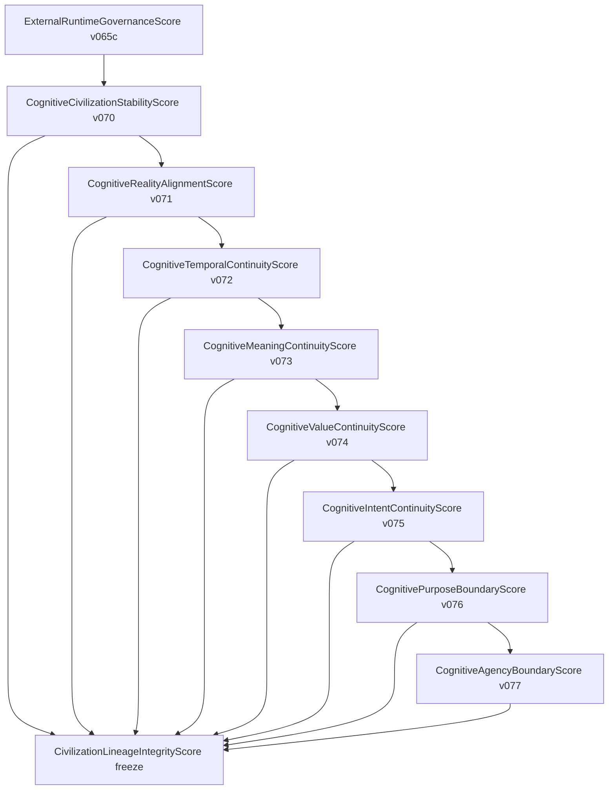

# Civilization Dependency Graph — v070–v077

## Score inheritance chain

## Governor attachment order

## Module dependencies (governance)

| Child | Depends on |
|-------|------------|
| v071 reality | v070 civilization anchor patterns |
| v072 temporal | v071 reality alignment report |
| v073 meaning | v072 temporal continuity report |
| v074 value | v073 meaning continuity report |
| v075 intent | v074 value continuity report |
| v076 purpose | v075 intent continuity report |
| v077 agency | v076 purpose boundary report |

Each observability package imports the parent score evaluator and applies a layer-specific metric bonus (weights ~0.021–0.024 per dimension).
